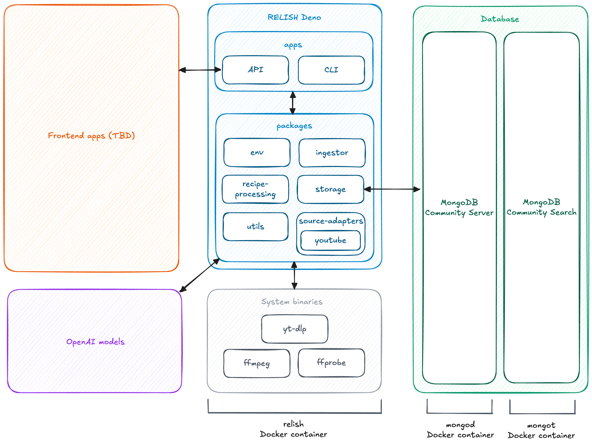

# Relish Recipe Digital Twin

[RELISH](https://relisheu.org) - *Reframing European Gastronomy Legacy through Innovation, Sustainability and Heritage*, explores how traditional European food culture can be preserved, transformed, and transmitted, particularly through recipes, using digital and AI-powered technologies.

This repository implements a first digital twin for intangible cultural heritage that models food recipes as living artifacts. It virtually represents recipes and monitors their real-world preparation in near real time by analyzing YouTube videos through some kind of a *people-as-sensors* approach.

The system extracts structured recipe data (ingredients, tools, steps, and more) from unstructured video content, enabling the detection of variations, trends, and changes over time, and is designed to simulate possible future recipe evolutions based on observed patterns and external factors.

## Architecture diagram

### Components

- **RELISH Deno**\
  The main RELISH system, written in TypeScript and running on Deno.
  - **`apps`**\
    Entrypoints to the RELISH system.
    - `api`\
      A web API to control the system.
    - `cli`\
      A CLI to control the system.
  - **`packages`**\
    Shared reusable libraries.
    - `env`\
      Handles loading and validating environment variables.
    - `ingestor`\
      Logic to ingest data from external sources into the RELISH database.
    - `modeling` (placeholder)\
      Simulate the evolution of recipes based on certain factors.
    - `recipe-processing`\
      Logic to parse the unstructured or semi-structured description of a recipe into a well-defined structure.
    - `source-adapters`\
      Logic to fetch recipe data from external sources.
      - `bluesky` (placeholder)
      - `youtube`
    - `storage`\
      Logic to store data in the db or in the file system.
    - `utils`\
      Shared utilities for things such as logging, running shell commands, etc.
- **System binaries**: these must be accessible in `PATH` on the machine where **RELISH Deno** is running.
  - **yt-dlp**: used to download videos from YouTube.
  - **ffmpeg**: used to manipulate video files.
  - **ffprobe**: used to get video metadata.
- **Database**
  - **MongoDB Community Server**: core database engine.
  - **MongoDB Community Search**: search service based on Apache Lucene.
- **OpenAI models**\
  Right now the system is using the following models:
  - **GPT-4o mini** for text generation
  - **GPT-4.1** for image description
  - **Whisper-1** for audio transcription
  - **text-embedding-ada-002** to create embeddings

## Running locally

### Requirements

- To run the whole system using Docker, you only need [Docker](https://www.docker.com/) (obviously).
- Alternatively, you can run the database using Docker and the rest of the system locally, which is handy for development. In this case, you're going to need:
  - [Docker](https://www.docker.com/)
  - [Deno](https://deno.com/)
  - [yt-dlp](https://github.com/yt-dlp/yt-dlp) in `PATH` to download videos from YouTube
  - [ffmpeg](https://ffmpeg.org/) and [ffprobe](https://ffmpeg.org/ffprobe.html) in `PATH` to get metadata and process videos

> [!NOTE]
> The system could theoretically run on a custom MongoDB instance instead of the Docker one configured in this repo, but that instance must support vector search indexes.

### Procedure

**Fully on Docker**

TODO

**Only the database on Docker**

TODO
