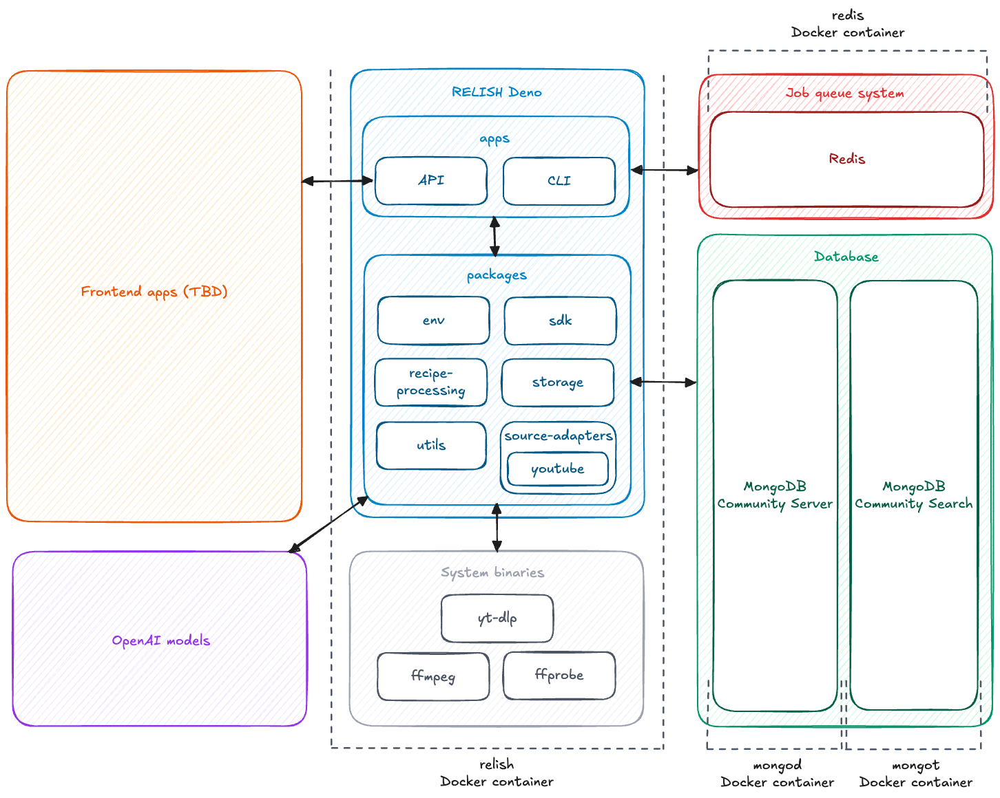

<div align="center">

# Relish Recipe Digital Twin


</div>

[RELISH](https://relisheu.org) - *Reframing European Gastronomy Legacy through Innovation, Sustainability and Heritage*, explores how traditional European food culture can be preserved, transformed, and transmitted, particularly through recipes, using digital and AI-powered technologies.

This repository implements a first digital twin for intangible cultural heritage that models food recipes as living artifacts. It virtually represents recipes and monitors their real-world preparation in near real time by analyzing YouTube videos through some kind of a *people-as-sensors* approach.

The system extracts structured recipe data (ingredients, tools, steps, and more) from unstructured video content, enabling the detection of variations, trends, and changes over time, and is designed to simulate possible future recipe evolutions based on observed patterns and external factors.

## Architecture diagram

<div align="center">



</div>

### Components

- **RELISH Deno**\
  The main RELISH system, written in TypeScript and running on Deno.
  - **`apps`**\
    Entrypoints to the RELISH system.
    - `api`\
      A web API to control the system.
    - `cli`\
      A CLI to control the system.
  - **`packages`**\
    Shared reusable libraries.
    - `env`\
      Handles loading and validating environment variables.
    - `sdk`\
      Shared business logic for CRUD operations on the Relish database.
    - `modeling` (placeholder)\
      Simulate the evolution of recipes based on certain factors.
    - `recipe-processing`\
      Logic to parse the unstructured or semi-structured description of a recipe into a well-defined structure.
    - `sdk`\
      Provides a universal client to interact with the system. The web API and CLI apps are based on this SDK.
    - `source-adapters`\
      Logic to fetch recipe data from external sources.
      - `bluesky` (placeholder)
      - `youtube`
    - `storage`\
      Logic to store data in the db or in the file system.
    - `utils`\
      Shared utilities for things such as logging, running shell commands, etc.
- **System binaries**: these must be accessible in `PATH` on the machine where **RELISH Deno** is running.
  - **yt-dlp**: used to download videos from YouTube.
  - **ffmpeg**: used to manipulate video files.
  - **ffprobe**: used to get video metadata.
- **Database**
  - **MongoDB Community Server**: core database engine.
  - **MongoDB Community Search**: search service based on Apache Lucene.
- **Job queue system**
  - **Redis**: to persist the queue state
- **OpenAI models**\
  Right now the system is using the following models:
  - **GPT-4o mini** for text generation
  - **GPT-4.1** for image description
  - **Whisper-1** for audio transcription
  - **text-embedding-ada-002** to create embeddings

## Running locally

### Requirements

- To run the whole system using Docker, you only need [Docker](https://www.docker.com/) (obviously).
- Alternatively, you can run the database and Redis using Docker and the rest of the system locally, which is handy for development. In this case, you're going to need:
  - [Docker](https://www.docker.com/)
  - [Deno](https://deno.com/)
  - [yt-dlp](https://github.com/yt-dlp/yt-dlp) in `PATH` to download videos from YouTube
  - [ffmpeg](https://ffmpeg.org/) and [ffprobe](https://ffmpeg.org/ffprobe.html) in `PATH` to get metadata and process videos

> [!NOTE]
> The system could theoretically run on a custom MongoDB instance instead of the Docker one configured in this repo, but that instance must support vector search indexes.

### Procedure

**Preliminary steps**

- Clone this repo
- Create a `.env` in its root and fill it in with the required variables (see `.env.example`)
- Generate security files (keyfile and passwordFile) using Docker
  ```bash
  # You can use this shorthand if Deno is installed
  deno task setup
  # Or the full command otherwise
  docker compose --profile setup run --rm relish-setup-generator
  ```

**Option a. Fully on Docker**

- Run one of the following commands:

  ```bash
  # You can use this shorthand if Deno is installed
  deno task sys:up
  # Or the full command otherwise
  docker compose up relish-api relish-worker mongod mongot redis --build -d --scale relish-worker=3
  ```

**Option b. Only the database on Docker** (best for local development)

- Run one of the following commands:

  ```bash
  # Start Mongo using Docker
  deno task db:start
  # Push the database schema
  deno task db:push
  ```

**Accessing protected routes**

The system uses API keys to protect routes and resources. Keys can only be managed via CLI (no REST APIs). You can get an overview of the available commands by running `deno task cli:start`.

- To create a new API key with full access to every endpoint, run the following command:

  ```bash
  deno task cli:start api-keys create --name "Full access" --access "
    Dish:CREATE,READ,UPDATE,DELETE
    Recipe:CREATE,READ,UPDATE,DELETE
    RecipeInstance:CREATE,READ,UPDATE,DELETE
    Ingredient:CREATE,READ,UPDATE,DELETE
    Tool:CREATE,READ,UPDATE,DELETE
    Task:CREATE,READ,UPDATE,DELETE"
  ```

- To create an API key with partial access, just remove a row from the above command (to revoke CRUD access to a certain collection), or an action to forbid a specific operation from a specific collection.

- Access to the `Task` collection carries the ability to retrieve current and past tasks (`READ`) and to launch new ones (`CREATE`)

## Notes on development practices

### Classes

The project tries to avoid using classes in favor of a simpler, more concise factory function and composition approach. Classes should generally be used to extend the `Error` class, and nothing more.

### Dependency management

The code in the project can run in three different environments: REST API handlers, direct execution (CLI), and worker threads. Potentially, all three can run code at the same time, in parallel. To prevent concurrency issues, and to provide different dependency implementations based on the environment, a minimal dependency injection setup based on AsyncLocalStorage was created under `packages/di`.

TL;DR:

1. Wrap any entrypoint in a `withDependencies` call, providing the required dependencies. Current entrypoints include: `apps/cli/main.ts`, `apps/api/main.ts`, and `apps/api/tasks/worker.ts`.
2. If a dependency requires another dependency to initialize, wrap its creation in `withSelectedDependencies`, passing the required dependencies.
3. Use dependency getters (e.g. `getLogger`) from anywhere, as long as somewhere up in the tree a `withDependencies` or `withSelectedDependencies` function wraps the chain to provide the required dependencies (point 1).
